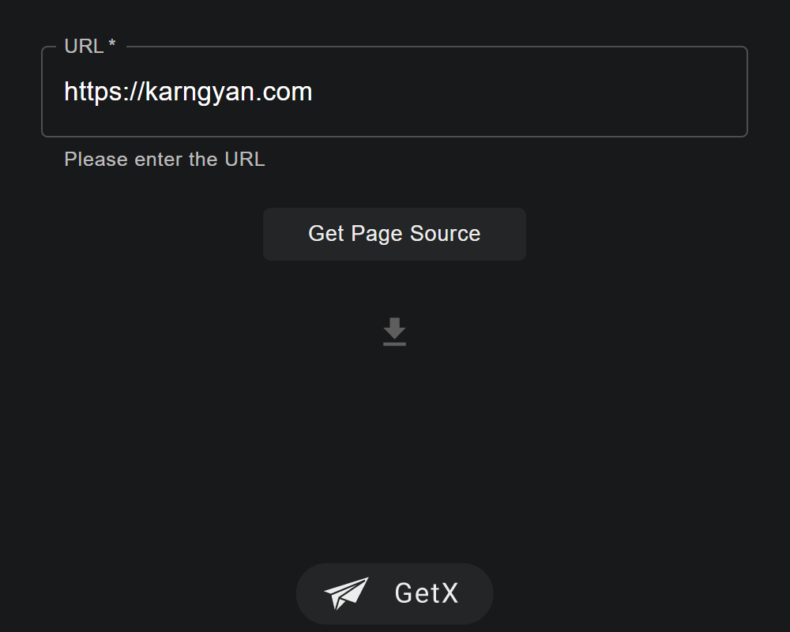
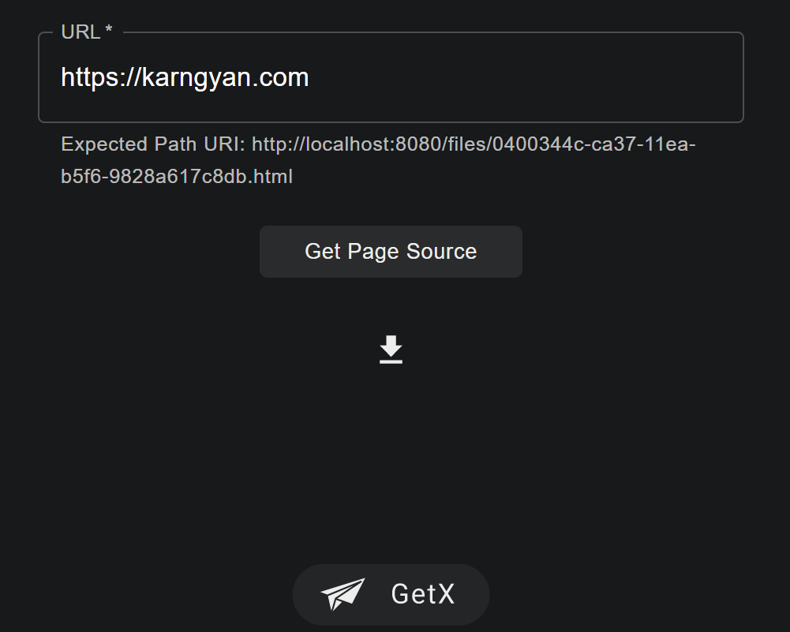

# GetX

## gist

- Given url of a webpage, server fetches the html, dumps it to a file and serves it to the client.
- Request Made -> server sends back the expected path of the file to the client and simultaneously spawns 
a go routine at the same time which retries fetching the webpage every hour using a ticker, `retryLimit` number of times.
> retryLimit is customizable
 
##  milestones

- [x] fetch html by url and dump it to a file
- [x] retry go routine
- [ ] implement persistent queue
- [x] frontend


## run

`go run main.go`

cd into client directory and run

`yarn start` or `npm run start`

Visit: `http://localhost:3000`

## screenshots

<p align="center">
    
    
</p>

## api


- Once the server is on, try the following request: 
- /pagesource 
- Method: POST
- Data:
```json
{
  "uri": "https://google.com",
  "retryLimit": 3
}
```
E.g.
 ```
curl --location --request POST 'http://localhost:7771/pagesource' \
--header 'Content-Type: application/json' \
--data-raw '{
    "uri": "https://google.com",
    "retryLimit": 3
}'
```

- Sample Response: 200

```
{
    "id": "d27913f6-c8ea-11ea-81ea-9828a617c8db",
    "uri": "https://google.com",
    "sourceUri": "/files/d27913f6-c8ea-11ea-81ea-9828a617c8db.html",
    "retryLimit": 3
}
```

- visit pagesource at: `localhost:7771/sourceUri`
- SourceUri is also in the `Location` header of the response

 ## todo
 
 - Persistent queue
 - Host it may be?